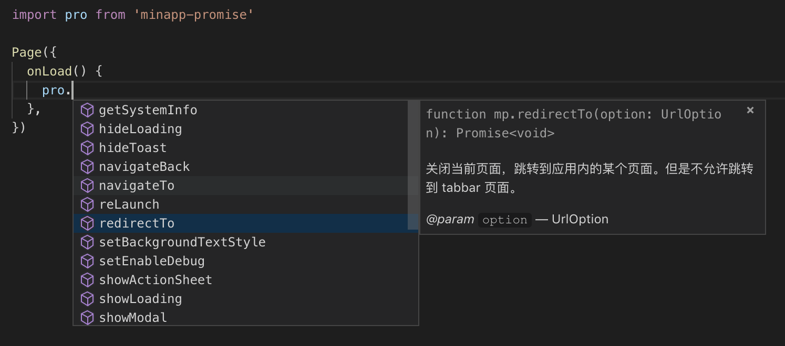

# minapp-promise

不到 1KB 的小程序异步接口 Promise 化，支持所有[小程序异步接口](https://developers.weixin.qq.com/miniprogram/dev/api/)

## 如何使用

1. 通过 npm 安装（确保已开启 `使用 npm 模块` 功能）

    ```sh
    npm install minapp-promise
    ```

2. 构建

    在微信开发者工具中依次点击 `工具` - `构建 npm`

3. 在代码中引入

    ```javascript
    import pro from 'minapp-promise'

    pro.showToast({ title }).then(doSomething)
    pro.request({ url }).then(handleResponse).catch(handleError)
    ```

4. 配合 `VSCode` 使用可获得代码提示



## 注意事项

- 确保开发者工具中 `ES6 转 ES5` 选项开启

    `minapp-promise` 使用 ES6 新特性 `Proxy` 来代理 `wx` 对象，而现阶段仅有 iOS 10+ 支持这个特性（[信息来源](https://developers.weixin.qq.com/miniprogram/dev/devtools/details.html#客户端es6-api-支持情况)）。

- 仅支持带有 `success` 和 `fail` 回调的异步接口

    为了实现起来更方便，并未对 `wx` 对象中的同步接口进行特殊处理，使用者须自行甄别[接口文档](https://developers.weixin.qq.com/miniprogram/dev/api/)中的异步接口

- `complete` 支持

    原生 `Promise` 并不支持 `finally` 方法，为此，如果你想使用 `complete` 回调，请作为参数传递

    ```javascript
    pro.showToast({
      title: 'Hello, world',
      complete: () => console.log('showToast completed'),
    })
      .then(() => console.log('showToast succeeded'))
      .catch(() => console.log('showToast failed'))
    ```

- `d.ts` 文件

    由于个人精力有限，且小程序接口太多，所以目前只写了一部分接口的类型声明，预计将在一个月之内完成全部类型声明。

## 更新记录

### v0.1.0

#### Feats:

- 添加部分接口的 `d.ts`，可在 `VSCode` 中进行代码提示

#### Fixes:

- 解决新版开发者工具中打开 `上传时进行代码保护` 后编译报错

### v0.0.2

#### Chores:

- 更新文档
- 添加 `wx` declare 以去除 `flow` 报错

### v0.0.1

#### Feats:

- 实现功能